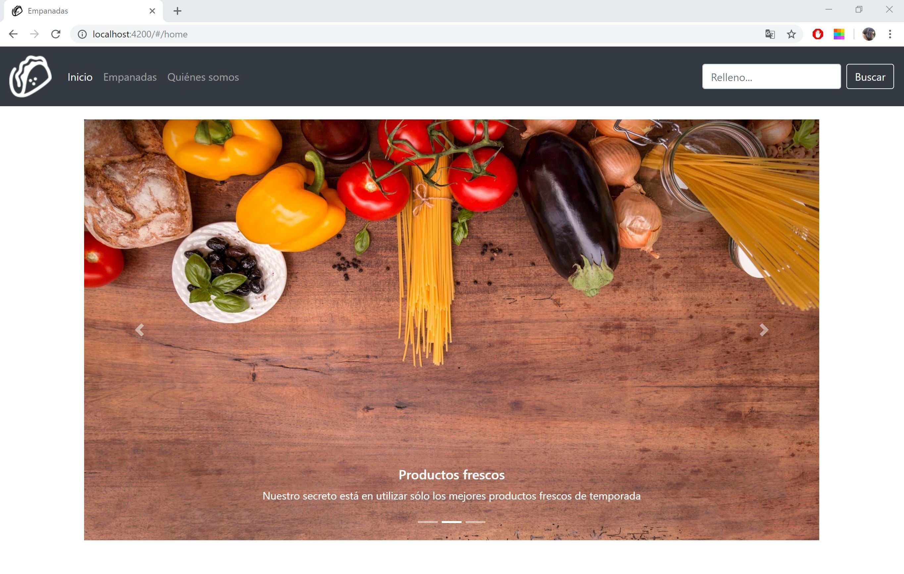
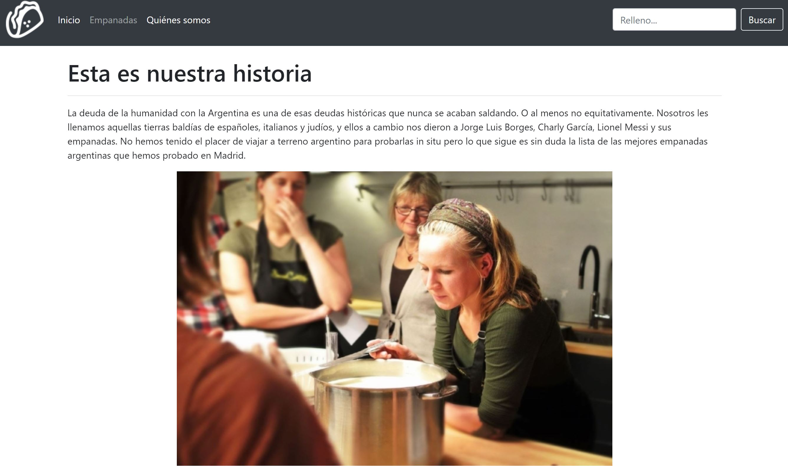
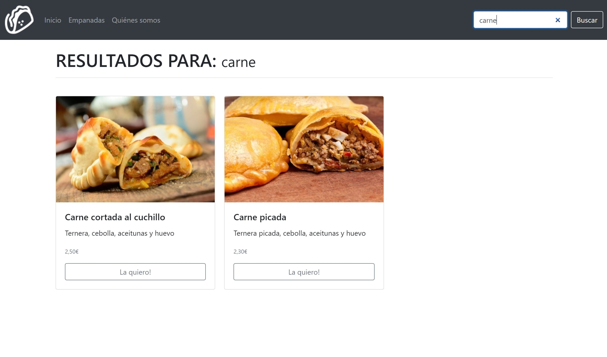

# EMPANADAS

## OBJETIVE

It is the website model of a restaurant that sells Argentine empanadas. From here you can see, select and buy empanadas.

## DESIGN (screenshots)

### Inicio

### Acerca de nosotros

### Empanadas

### Empanada seleccionada

### Buscador

### Vista móvil

# Technologies

The main resources that have been utlizied in this project are:

- JAVASCRIPT
- ANGULAR
- CSS FRAMEWORK: BOOTSTRAP

## Available Scripts

In the project directory server, you can run:

### `npm start`

In the project directory client, you can run:

Run `ng serve` for a dev server. Navigate to `http://localhost:4200/`. The app will automatically reload if you change any of the source files.
